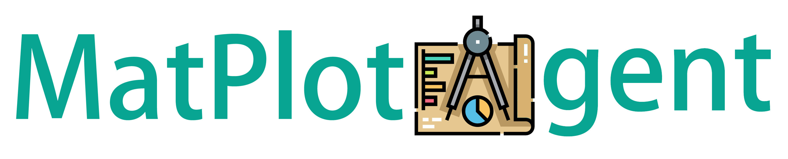
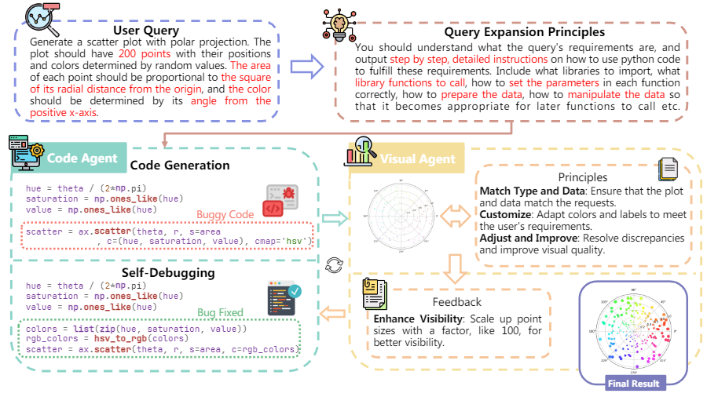
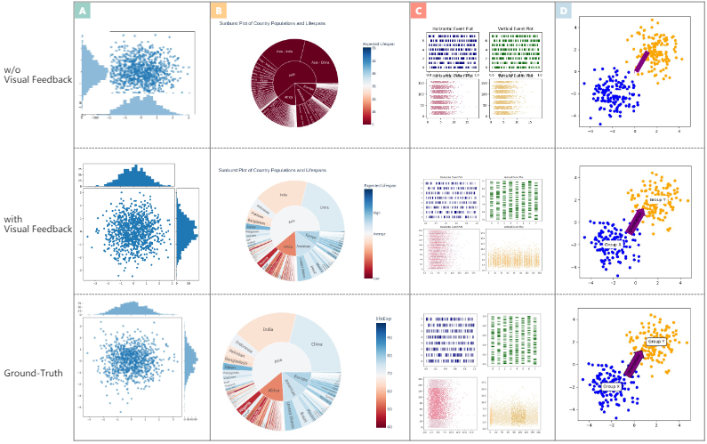
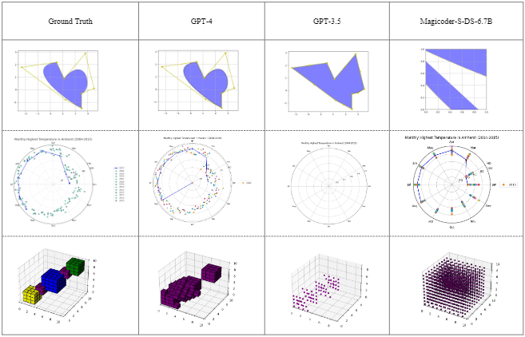

<div align="center">



**MatPlotAgent: Enhancing Scientific Data Visualization with LLMs**

<p align="center">•
 <a href="#-introduction"> 📖Introduction </a> •
 <a href="#-news">🎉News</a> •
 <a href="#-contributions">✨Contributions</a> •
 <a href="#%EF%B8%8F-getting-started">⚡️Getting Started</a> •
 <a href="#-experiment-results">📊Experiment Results</a> •
 <a href="#-citation">🔎Citation </a> •
 <a href="https://arxiv.org/abs/2402.11453">📃Paper</a>
</p>
</div>

# 📖 Introduction
Scientific data visualization is crucial for conveying complex information in research, aiding in the identification of implicit patterns. Despite the potential, the use of Large Language Models (LLMs) for this purpose remains underexplored. **MatPlotAgent** introduces an innovative, model-agnostic LLM agent framework designed to automate scientific data visualization tasks, harnessing the power of both code LLMs and multi-modal LLMs.

The integration of LLMs into scientific data visualization represents a new frontier in technologies aiding research. Current tools for humans, such as Matplotlib and Origin, pose challenges in transforming raw data into insightful visualizations due to time-consuming and labor-intensive processes. **MatPlotAgent** is conceived to bridge this gap, leveraging LLM capabilities to enhance human efficiency significantly. **MatPlotBench** is curated to further traction the field of AI-automated scientific data visualization by providing a comprehensive benchmark and trustworthy automatic evaluation method.

# 🎉 News

* March 7, 2024: Releasing the MatPlotAgent, an innovative and model-agnostic framework designed to revolutionize scientific data visualization by automating tasks with advanced LLMs, and introducing MatPlotBench, a comprehensive and meticulously curated benchmark that sets a new standard for evaluating AI-driven visualization tools. 🌟


# ✨ Contributions

- **MatPlotAgent Framework**: Comprises three core modules for a comprehensive approach to data visualization:
  1. **Query Expansion**: Thoroughly interprets user requirements and transform them into LLM-friendly instructions
  2. **Code Generation with Iterative Debugging**: Uses code to preprocess data and generate figures, with self-debugging capabilities.
  3. **Visual Feedback Mechanism**: Employs visual perceptual abilities for error identification and correction.

<div align="center">
  
</div>

- **MatPlotBench**: A high-quality benchmark of 100 human-verified test cases alongside a scoring approach utilizing GPT-4V for automatic evaluation, demonstrating strong correlation with human-annotated scores.

- **Generalizability**: Demonstrated effectiveness with various LLMs, including commercial and open-source models.


# ⚡️ Getting Started

This project opensources the following components to foster further research and development in the field of scientific data visualization:

- **Benchmark Data (MatPlotBench)**: A meticulously crafted benchmark to quantitatively evaluate data visualization approaches.
- **Evaluation Pipeline**: Utilizes GPT-4V for automatic evaluation, offering a reliable metric that correlates strongly with human judgment.
- **MatPlotAgent Framework**: The entire codebase for the MatPlotAgent framework is available, encouraging adaptation and improvement by the community.

<!-- #TODO
[Instructions on how to access and use the benchmark data, evaluation pipeline, and the MatPlotAgent framework.] -->

Benchmark Data (MatPlotBench) can be found in the `./benchmark_data` folder.

The code requires some dependencies as specified in requirements.txt. Please follow the relevant libraries to install or run:

```
pip install -r requirements.txt
```


## MatPlotAgent Framework

### Configuration

If you're using the open-source model, please download the model to your local machine first and adjust the location of the corresponding model in `models/model_config.py`.

If you're using GPT-3.5 or GPT-4, please update your `API_KEY` in `agents/config/openai.py`.

### Running OpenAI-Compatible Server

If you're utilizing GPT-3.5 or GPT-4, you can skip this section.

We use vLLM to deploy the open-source model as a server, implementing the OpenAI API protocol. This enables vLLM to seamlessly replace applications using the OpenAI API.

Ensure you have vLLM installed and configured on your local machine.

We provide scripts to deploy the API server. For instance, to deploy `CodeLlama-34b-Instruct`, you can execute:

```
bash models/scripts/CodeLlama-34b-Instruct-hf.sh
```

If you need to modify the script's content, please refer to the [vLLM documentation](https://docs.vllm.ai/en/latest/index.html).

### Running MatPlotAgent Framework

To execute the MatPlotAgent framework, use the following script:

```bash
python workflow.py \
    --model_type=MODEL \
    --workspace=path/to/result
```

Replace `MODEL` with the desired model. All available `model_type` options can be found in `models/model_config.py`.

Replace `path/to/result` with the desired path to save the results.

For direct decoding, use:

```bash
python one_time_generate.py \
    --model_type=MODEL \
    --workspace=path/to/result
```

For zero-shot COT, use:

```bash
python one_time_generate_COT.py \
    --model_type=MODEL \
    --workspace=path/to/result
```

## Evaluation Pipeline

After running the MatPlotAgent Framework, you can utilize the Evaluation Pipeline to obtain automatic evaluation scores.

First, replace `directory_path` with `path/to/result` in `evaluation/api_eval.py` and `evaluation/average_score_calc.py`.

Then, run:

```bash
bash evaluation/eval.sh
```

After running the above command, execute:

```bash
cd evaluation
python average_score_calc.py
```

You will receive the score.


# 📊 Experiment Results

Our experiments showcase MatPlotAgent's ability to improve LLM performance across a variety of tasks, with notable enhancements in plot quality and correctness, supported by both quantitative scores and qualitative assessments.

Performance of different LLMs on MatPlotBench. For each model, improvements over the direct decoding are highlighted in **bold**.

| Model                                         | Direct Decod. | Zero-Shot CoT | MatPlotAgent      |
|-----------------------------------------------|---------------|---------------|-------------------|
| **GPT-4**                                     | 48.86         | 45.42 (-3.44) | 61.16 (**+12.30**)|
| **GPT-3.5**                                   | 38.03         | 37.14 (-0.89) | 47.51 (**+9.48**) |
| **Magicoder-S-DS-6.7B** ([Wei et al.,](https://arxiv.org/abs/2312.02120))    | 38.49         | 37.95 (-0.54) | 51.70 (**+13.21**)|
| **Deepseek-coder-6.7B-instruct** ([Guo et al.,](https://arxiv.org/abs/2401.14196)) | 31.53  | 29.16 (-2.37) | 39.45 (**+7.92**)  |
| **CodeLlama-34B-Instruct** ([Rozière et al.,](https://arxiv.org/abs/2308.12950))  | 16.54         | 12.40 (-4.14) | 14.18 (-2.36)     |
| **Deepseek-coder-33B-instruct** ([Guo et al.,](https://arxiv.org/abs/2401.14196))  | 30.88  | 36.10 (**+5.22**) | 32.18 (**+1.30**)|
| **WizardCoder-Python-33B-V1.1** ([Luo et al.,](https://arxiv.org/abs/2306.08568))   | 36.94  | 35.81 (-1.13) | 45.96 (**+9.02**) |


## 📈 Ablation and Case Study
Examples to illustrate the effect of visual feedback. To investigate the effect of the visual feedback mechanism on different models, we display the outputs of two representative LLMs. Case A, B, and C are generated by GPT-4. Case D is generated by Magicoder-S-DS-6.7B.
<div align="center">
  
</div>

Case study of different models
<div align="center">
  
</div>


# 🔎 Citation

Feel free to cite the paper if you think MatPlotAgent is useful.

```bibtex
@misc{yang2024matplotagent,
      title={MatPlotAgent: Method and Evaluation for LLM-Based Agentic Scientific Data Visualization}, 
      author={Zhiyu Yang and Zihan Zhou and Shuo Wang and Xin Cong and Xu Han and Yukun Yan and Zhenghao Liu and Zhixing Tan and Pengyuan Liu and Dong Yu and Zhiyuan Liu and Xiaodong Shi and Maosong Sun},
      year={2024},
      eprint={2402.11453},
      archivePrefix={arXiv},
      primaryClass={cs.CL}
}
```


